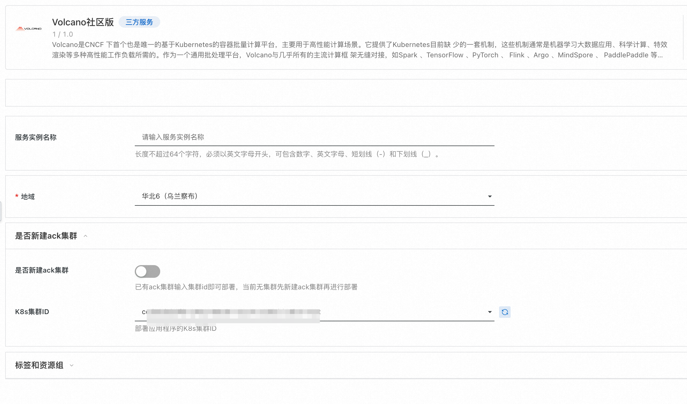
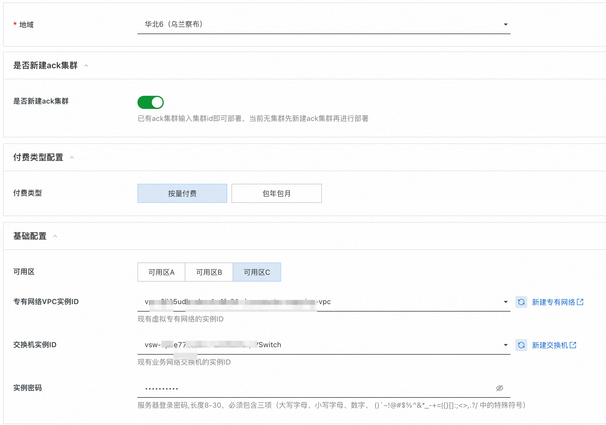
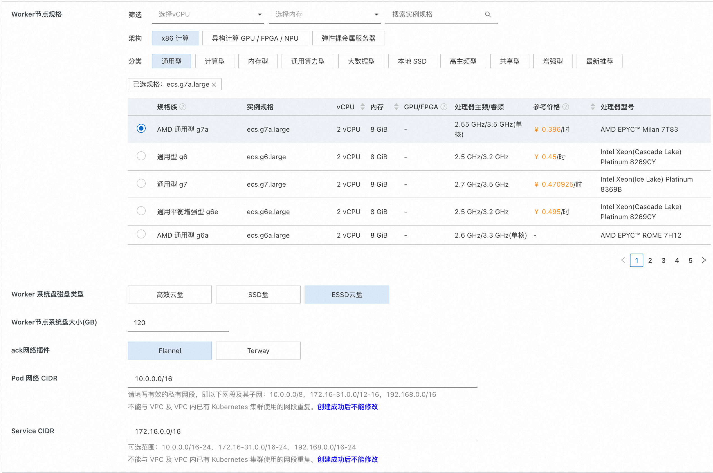
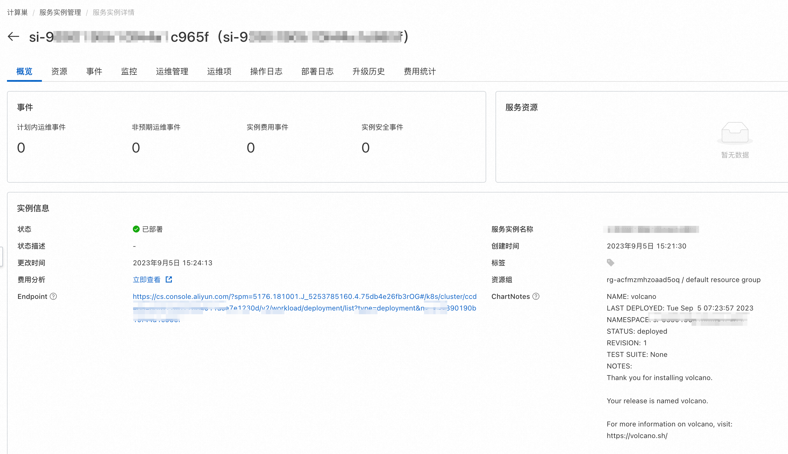
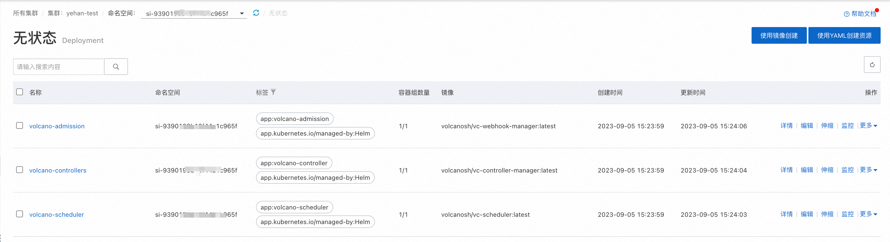

# Volcano服务实例部署文档

## 概述

Volcano是CNCF 下首个也是唯一的基于Kubernetes的容器批量计算平台，主要用于高性能计算场景。它提供了Kubernetes目前缺 少的一套机制，这些机制通常是机器学习大数据应用、科学计算、特效渲染等多种高性能工作负载所需的。作为一个通用批处理平台，Volcano与几乎所有的主流计算框 架无缝对接，如Spark 、TensorFlow 、PyTorch 、 Flink 、Argo 、MindSpore 、 PaddlePaddle 等。它还提供了包括基于各种主流架构的CPU、GPU在内的异构设备混合调度能力。Volcano的设计 理念建立在15年来多种系统和平台大规模运行各种高性能工作负载的使用经验之上，并结合来自开源社区的最佳思想和实践。

服务本身免费，只用为云服务资源付费，欢迎大家使用。
## 实例说明
Volcano部署的为社区开源版本，源码参考[Github Repo](https://github.com/volcano-sh/volcano)，目前支持两种模式进行部署。
- 已有阿里云ack集群，这种情况下可以直接将服务部署到该集群中，用户不需付费。
- 新建阿里云ack集群，然后部署服务，这种情况下只用支付ack资源本身的费用。

具体费用见创建服务实例时费用预估。
## 部署流程
### 1.部署入口
您可以在阿里云计算巢自行搜索，也可以通过下述部署链接快速到达。

[部署链接](https://computenest.console.aliyun.com/user/cn-hangzhou/serviceInstanceCreate?ServiceId=service-c107233607214c2c91b5)
### 2.创建服务实例
#### 2.1 已有ack集群部署

用户已有ack集群的情况下，进行如下操作：
- 选择ack集群所在地域
- 是否新建ack集群选择否
- 选择已有的k8s集群

#### 2.2 新建ack集群部署

新建ack集群的情况下，进行如下操作：
- 选择地域、付费类型。
- 选择可用区，并在可用区下选择vpc实例和交换机实例，不存在的情况下点击右侧按钮新建。
- 选择ack节点规格、磁盘类型和磁盘大小，默认集群节点数为3台。
- 选择ack网络插件，目前支持flannel和terway,并分别填入对应的pod网段和service网段。
### 3.服务实例详情

部署成功的服务实例详情如上图所示，endpoint为对应的ack集群管理页面地址，chartNotes为chart安装说明，点击ack集群
地址，可以查看服务部署情况，证明服务已安装成功，后续可以提交任务进行运行了。

